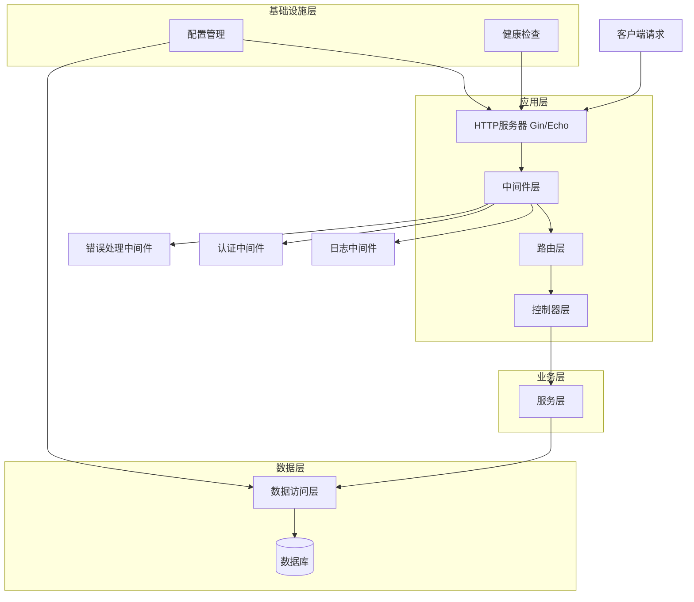
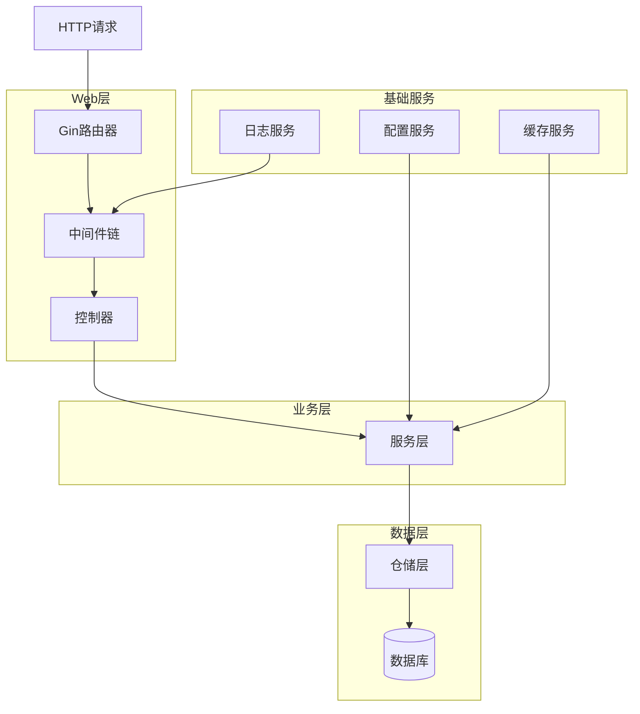
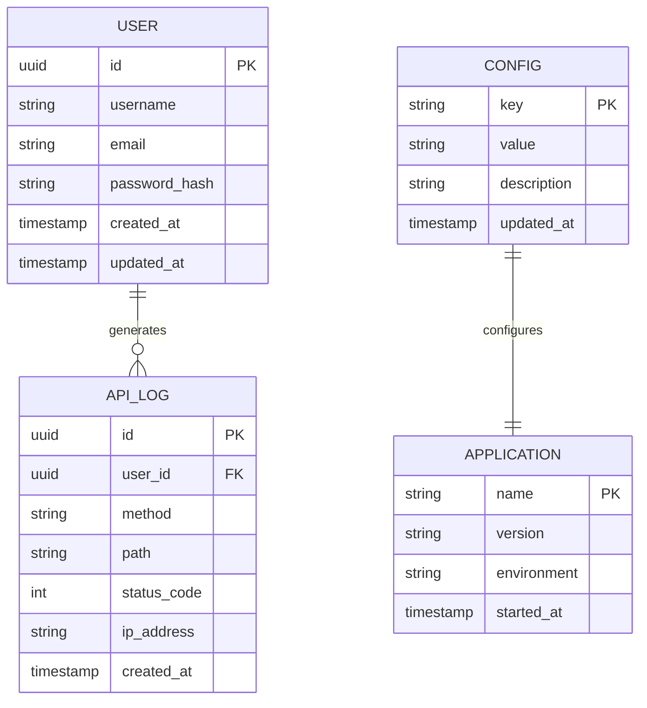

# Go语言API脚手架框架技术架构文档

## 1. 架构设计



## 2. 技术描述

* **前端**: 无（纯后端API框架）

* **后端**: Go\@1.21 + Gin\@1.9 + GORM\@1.25 + Viper\@1.17

* **数据库**: PostgreSQL/MySQL（通过GORM支持多种数据库）

* **缓存**: Redis\@7.0（可选）

* **配置管理**: Viper + 环境变量

* **日志**: Logrus/Zap

* **文档**: Swagger/OpenAPI 3.0

## 3. 路由定义

| 路由         | 用途                   |
| ---------- | -------------------- |
| /health    | 健康检查端点，返回服务状态和系统信息   |
| /api/v1/\* | API版本1的所有业务接口        |
| /docs      | Swagger API文档界面      |
| /metrics   | Prometheus监控指标端点（可选） |

## 4. API定义

### 4.1 核心API

健康检查接口

```
GET /health
```

响应:

| 参数名称      | 参数类型   | 描述                     |
| --------- | ------ | ---------------------- |
| status    | string | 服务状态：healthy/unhealthy |
| timestamp | string | 检查时间戳                  |
| version   | string | 应用版本号                  |
| database  | object | 数据库连接状态                |

示例

```json
{
  "status": "healthy",
  "timestamp": "2024-01-15T10:30:00Z",
  "version": "1.0.0",
  "database": {
    "status": "connected",
    "ping_time": "2ms"
  }
}
```

通用API响应格式

```
POST/GET/PUT/DELETE /api/v1/*
```

请求:

| 参数名称          | 参数类型   | 是否必需  | 描述               |
| ------------- | ------ | ----- | ---------------- |
| Authorization | string | false | Bearer token认证头  |
| Content-Type  | string | true  | application/json |

响应:

| 参数名称      | 参数类型   | 描述    |
| --------- | ------ | ----- |
| code      | int    | 业务状态码 |
| message   | string | 响应消息  |
| data      | object | 响应数据  |
| timestamp | string | 响应时间戳 |

示例

```json
{
  "code": 200,
  "message": "success",
  "data": {
    "id": 1,
    "name": "example"
  },
  "timestamp": "2024-01-15T10:30:00Z"
}
```

## 5. 服务器架构图



## 6. 数据模型

### 6.1 数据模型定义



### 6.2 数据定义语言

用户表 (users)

```sql
-- 创建用户表
CREate TABLE users (
    id UUID PRIMARY KEY DEFAULT gen_random_uuid(),
    username VARCHAR(50) UNIQUE NOT NULL,
    email VARCHAR(100) UNIQUE NOT NULL,
    password_hash VARCHAR(255) NOT NULL,
    created_at TIMESTAMP WITH TIME ZONE DEFAULT NOW(),
    updated_at TIMESTAMP WITH TIME ZONE DEFAULT NOW()
);

-- 创建索引
CREATE INDEX idx_users_username ON users(username);
CREATE INDEX idx_users_email ON users(email);
CREATE INDEX idx_users_created_at ON users(created_at DESC);

-- 初始化数据
INSERT INTO users (username, email, password_hash) VALUES 
('admin', 'admin@example.com', '$2a$10$example_hash'),
('demo', 'demo@example.com', '$2a$10$example_hash');
```

API日志表 (api\_logs)

```sql
-- 创建API日志表
CREATE TABLE api_logs (
    id UUID PRIMARY KEY DEFAULT gen_random_uuid(),
    user_id UUID REFERENCES users(id),
    method VARCHAR(10) NOT NULL,
    path VARCHAR(255) NOT NULL,
    status_code INTEGER NOT NULL,
    ip_address INET,
    response_time INTEGER,
    created_at TIMESTAMP WITH TIME ZONE DEFAULT NOW()
);

-- 创建索引
CREATE INDEX idx_api_logs_user_id ON api_logs(user_id);
CREATE INDEX idx_api_logs_created_at ON api_logs(created_at DESC);
CREATE INDEX idx_api_logs_status_code ON api_logs(status_code);
CREATE INDEX idx_api_logs_path ON api_logs(path);
```

配置表 (configs)

```sql
-- 创建配置表
CREATE TABLE configs (
    key VARCHAR(100) PRIMARY KEY,
    value TEXT NOT NULL,
    description TEXT,
    updated_at TIMESTAMP WITH TIME ZONE DEFAULT NOW()
);

-- 初始化配置数据
INSERT INTO configs (key, value, description) VALUES 
('app.name', 'Go API Scaffold', '应用名称'),
('app.version', '1.0.0', '应用版本'),
('app.environment', 'development', '运行环境'),
('db.max_connections', '100', '数据库最大连接数'),
('cache.ttl', '3600', '缓存过期时间（秒）');
```

应用信息表 (applications)

```sql
-- 创建应用信息表
CREATE TABLE applications (
    name VARCHAR(100) PRIMARY KEY,
    version VARCHAR(20) NOT NULL,
    environment VARCHAR(20) NOT NULL,
    started_at TIMESTAMP WITH TIME ZONE DEFAULT NOW()
);

-- 初始化应用信息
INSERT INTO applications (name, version, environment) VALUES 
('go-api-scaffold', '1.0.0', 'development');
```

