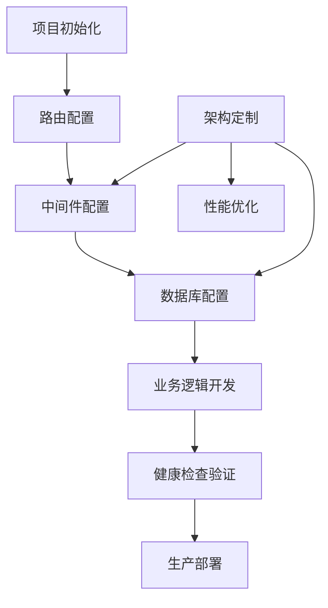

# Go语言API脚手架框架产品需求文档

## 1. 产品概述

本产品是一个简洁高效的Go语言API脚手架框架，旨在为开发者提供快速构建RESTful API服务的标准化解决方案。

该框架解决了Go API开发中的重复性工作问题，为开发者提供开箱即用的基础架构，显著提升开发效率和代码质量。

目标是成为Go语言生态中最受欢迎的轻量级API脚手架工具，帮助团队快速交付高质量的API服务。

## 2. 核心功能

### 2.1 用户角色

| 角色 | 使用方式 | 核心权限 |
|------|----------|----------|
| 后端开发者 | 直接使用脚手架代码 | 可以基于框架开发API服务，修改配置和业务逻辑 |
| 架构师 | 定制框架结构 | 可以扩展中间件，优化架构设计，制定开发规范 |

### 2.2 功能模块

我们的Go API脚手架框架包含以下核心模块：

1. **路由管理模块**：RESTful API路由注册、路径参数解析、HTTP方法映射
2. **中间件系统**：日志记录、请求验证、错误处理、跨域支持
3. **数据库集成**：连接池管理、配置模板、ORM集成支持
4. **响应处理**：统一JSON响应格式、状态码管理、错误信息标准化
5. **配置管理**：环境变量加载、配置文件解析、运行时配置热更新
6. **健康监控**：服务健康检查、系统状态监控、性能指标收集
7. **项目结构**：模块化目录组织、依赖注入、代码生成工具

### 2.3 页面详情

| 页面名称 | 模块名称 | 功能描述 |
|----------|----------|----------|
| 项目初始化 | 脚手架生成器 | 创建标准项目结构，生成基础代码文件，配置依赖管理 |
| 路由配置 | 路由管理 | 定义API端点，配置HTTP方法，设置路径参数和查询参数 |
| 中间件配置 | 中间件系统 | 配置日志级别，设置请求验证规则，定义错误处理策略 |
| 数据库配置 | 数据库集成 | 配置数据库连接参数，设置连接池大小，选择ORM框架 |
| 响应格式配置 | 响应处理 | 定义统一响应结构，配置状态码映射，设置错误消息模板 |
| 环境配置 | 配置管理 | 管理不同环境变量，配置文件模板，运行时参数调整 |
| 健康检查 | 健康监控 | 服务状态检查，数据库连接测试，系统资源监控 |

## 3. 核心流程

**开发者使用流程：**
1. 使用脚手架工具初始化项目结构
2. 根据业务需求配置路由和中间件
3. 设置数据库连接和环境变量
4. 开发具体的业务逻辑处理函数
5. 通过健康检查端点验证服务状态
6. 部署到生产环境

**架构师定制流程：**
1. 分析项目需求和技术栈
2. 扩展或修改中间件组件
3. 定制响应格式和错误处理策略
4. 优化数据库连接和性能配置
5. 制定团队开发规范和最佳实践

## 4. 用户界面设计

### 4.1 设计风格

- **主色调**：深蓝色 (#2C3E50) 和亮蓝色 (#3498DB)
- **辅助色**：灰色 (#95A5A6) 和绿色 (#27AE60)
- **按钮风格**：圆角矩形，扁平化设计
- **字体**：等宽字体 Consolas 14px，标题使用 16px 加粗
- **布局风格**：简洁的命令行界面风格，清晰的模块分层
- **图标风格**：简约线条图标，统一的视觉语言

### 4.2 页面设计概览

| 页面名称 | 模块名称 | UI元素 |
|----------|----------|--------|
| 项目初始化 | 脚手架生成器 | 命令行界面，进度条显示，项目名称输入框，模板选择下拉菜单 |
| 路由配置 | 路由管理 | 路由表格展示，HTTP方法标签，路径输入框，处理函数绑定 |
| 中间件配置 | 中间件系统 | 中间件列表，开关按钮，配置参数表单，执行顺序拖拽 |
| 数据库配置 | 数据库集成 | 连接字符串输入，数据库类型选择，连接测试按钮，配置预览 |
| 响应格式配置 | 响应处理 | JSON格式预览，状态码映射表，错误消息编辑器 |
| 环境配置 | 配置管理 | 环境变量表格，配置文件编辑器，环境切换标签页 |
| 健康检查 | 健康监控 | 状态指示灯，监控图表，日志输出窗口，刷新按钮 |

### 4.3 响应式设计

本框架主要面向开发者使用，采用桌面优先的设计策略，同时支持在不同尺寸的开发环境中良好展示，确保代码编辑和配置管理的便利性。